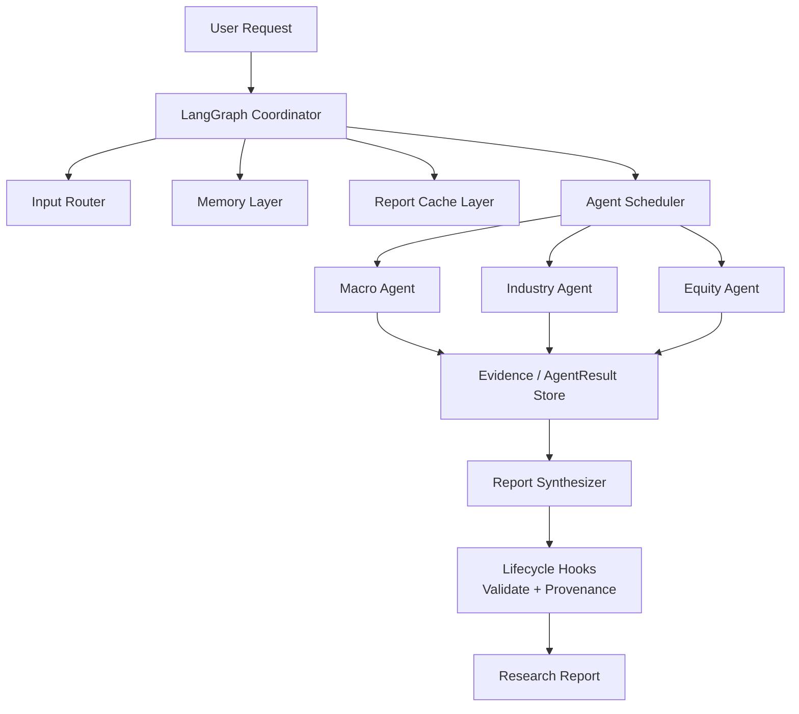

# FinAna - 智能投研助手

<div align="center">

**基于多智能体协作和 AI 大模型的自动化投资研究分析系统**

[](https://python.org)
[](https://fastapi.tiangolo.com)
[](https://gradio.app)
[](LICENSE)

[快速开始](#-快速开始) • [功能特性](#-功能特性) • [架构设计](#-架构设计) • [文档](docs/)

</div>

---

## 📖 项目简介

FinAna 是一个基于多智能体协作和真实 AI 大模型的自动化投资研究分析系统。用户输入自然语言查询（如"分析特斯拉股票的未来走势"），系统通过四个 AI 智能体协作，结合真实财经数据，生成专业级的投研报告。

### 核心优势

- 🤖 **AI 驱动**: 集成阿里云 DashScope Qwen3.5-plus 大语言模型
- 📊 **真实数据**: 从新浪财经、东方财富获取实时财经数据
- 💬 **多轮对话**: 支持连续追问，保留对话历史和上下文
- 💾 **智能缓存**: Redis + SeaweedFS 存储，相似查询秒级响应
- 🌐 **全球市场**: 支持美股、A 股、港股分析
- 📧 **用户与通知**: 支持用户画像、偏好和定时邮件报告
- 🧾 **数据可追溯**: 报告包含数据源、币种、as-of 时间和 fallback 标记
- 🧩 **可版本化 Prompt**: Agent 角色提示词位于 `prompts/`，由 prompt loader 统一加载

---

## ✨ 功能特性

### 1. 多智能体协作

| 智能体 | 职责 | 分析内容 |
|--------|------|----------|
| 🎯 输入路由器 | 查询理解 | 市场、股票、行业、分析类型 |
| 🏛️ 宏观分析师 | 经济环境分析 | GDP、CPI、利率、市场情绪 |
| 🏭 行业分析师 | 行业趋势分析 | 行业增长、竞争格局、政策法规 |
| 🏢 个股分析师 | 公司基本面分析 | 财务健康、技术指标、新闻资讯 |
| 📝 报告合成器 | 整合所有分析 | 生成完整投资建议和报告 |

Agent 边界通过 Pydantic contract 描述，包含 `AgentTask`、`AgentResult`、`Evidence` 和 `AgentRunMetadata`，用于约束输入、输出、证据、置信度和运行元数据。

### 2. 多轮对话支持

- 💬 **连续追问**: 基于之前的分析结果深入提问
- 🧠 **上下文记忆**: 自动保留对话历史和关键信息
- ⚡ **快速响应**: 相似问题直接返回缓存结果

**示例对话**:
```
用户：分析特斯拉股票
助手：[生成完整分析报告]

用户：它的估值合理吗？
助手：[基于之前的分析，详细解答估值问题]

用户：和比亚迪比哪个更值得投资？
助手：[对比分析两只股票]
```

### 3. 报告缓存与存储

- 📌 **Redis 缓存**: 存储报告摘要和索引，支持相似性搜索
- 🗄️ **SeaweedFS 存储**: 持久化存储完整报告内容
- ⚡ **快速检索**: 相似查询响应时间从 30 秒降至 0.5 秒
- 🔄 **自动过期**: 默认 7 天 TTL，智能管理缓存容量

### 4. 全链路日志追踪

- 🔍 **Trace ID 追踪**: 每个请求生成唯一 Trace ID，贯穿整个调用链
- 📝 **详细日志**: API → Workflow → Cache → Storage 全环节日志覆盖
- 🐛 **故障排查**: 通过 Trace ID 快速定位问题环节
- 📊 **性能分析**: 清晰展示各环节耗时和状态

**日志示例**:
```
[TRACE=abc12345] [API] 接收请求：POST /analysis/analyze
[TRACE=abc12345] [Workflow] 创建 AIResearchWorkflow 实例
[TRACE=abc12345] [Cache] 检查缓存中的相似报告
[TRACE=abc12345] [Redis] Finding similar reports: query='分析特斯拉...'
[TRACE=abc12345] [Cache] CACHE MISS - 未找到缓存报告
[TRACE=abc12345] [Analysis] Step 1/4: 宏观经济分析
[TRACE=abc12345] [Analysis] Step 2/4: 行业分析
[TRACE=abc12345] [Analysis] Step 3/4: 公司分析
[TRACE=abc12345] [SeaweedFS] Uploading report to /reports/us/TSLA/abc12345.md
[TRACE=abc12345] [Redis] Caching report summary
[TRACE=abc12345] [API] 返回响应：200 OK
```

### 5. 用户画像与定时报告

- 用户资料、关注股票、偏好和邮件设置由 `users/` 模块管理
- API 路由位于 `/users`
- 邮件通知由 `users.scheduler.SchedulerService` 通过 APScheduler 触发
- 生产环境默认建议将调度器显式开启，避免 `uvicorn --reload` 或多 worker 重复执行任务

### 6. 结构化输出与数据来源

- LLM JSON 输出通过 `agents/structured_output.py` 提取、枚举归一化和一次修复
- 宏观、行业、公司和报告 schema 均保留 `as_of`、`data_source`、`is_fallback` 等字段
- 报告末尾包含“数据来源与局限性”小节，用于披露默认数据、缓存命中和币种口径

### 7. 编排与生命周期 Hook

- `workflows/agent_scheduler.py` 统一封装 specialist agent 任务执行与边界校验
- `workflows/hooks.py` 提供输入校验、agent 结果校验、报告 provenance/compliance 校验、审计日志
- `workflows/langgraph_workflow.py` 在报告合成后执行显式 compliance check 节点

### 8. 支持的市场

| 市场 | 代码格式 | 示例 | 状态 |
|------|----------|------|------|
| 美股 | Ticker | TSLA, AAPL, NVDA | ✅ 已支持 |
| A 股 | sh/sz + 6 位 | sh600519, sz000858 | ✅ 已支持 |
| 港股 | HK + 5 位 | HK00700, HK09988 | ✅ 已支持 |
| 中概股 | Ticker | BABA, PDD, JD | ✅ 已支持 |

---

## 🏗️ 架构设计

### 系统架构图



### 工作流程

```
1. 用户查询
   │
   ▼
2. 输入路由分析 (识别股票、国家、行业、分析类型)
   │
   ▼
3. 检查缓存 (相似查询？)
   ├─ 命中 → 直接返回缓存报告
   └─ 未命中 → AgentScheduler 执行 AI 分析
       │
       ├── 宏观经济分析
       ├── 行业分析
       ├── 公司分析
       └── 报告合成 + 生命周期 Hook 合规检查
           │
           ▼
4. 存储报告 (SeaweedFS) + 缓存摘要 (Redis)
   │
   ▼
5. 返回给用户
```

---

## 🧠 详细设计（Plan 3-7）

本节对应重构计划中的第 3/4/5/6/7 项，解释“为什么这样设计、边界在哪里、如何演进”。

### 3) Agent Contracts（显式契约层）

**设计目标**
- 把“agent 间传什么数据”从隐式 Python dict 变成显式、可验证、可测试的协议。
- 在 agent 边界统一表达：输入任务、输出负载、证据、置信度、回退状态、运行元数据。

**核心抽象**
- `agents/contracts.py`
  - `AgentTask`：协调器发给 agent 的任务（query/country/sector/symbol/context）。
  - `AgentResult`：agent 返回结果（payload/confidence/evidence/metadata/is_fallback）。
  - `Evidence`：可追溯证据（source/as_of/content/url/is_fallback）。
  - `AgentRunMetadata`：运行元数据（agent_role/prompt_version/model/trace_id/warnings）。

**边界策略**
- Coordinator 不直接“信任”任意 agent 输出；统一经 `AgentResult` 包装后再进入后续节点。
- Evidence 是一等公民：报告 provenance、合规检查、缓存回放都依赖该层信息。

**收益**
- 契约漂移可通过测试提前发现。
- 后续接入 Risk Agent、Policy Agent 时无需改动现有 agent 内部实现，只需遵守契约。

---

### 4) Prompt Externalization（Prompt 外置与版本化）

**设计目标**
- 避免 Prompt 继续散落在 class 常量中，支持版本追踪、灰度切换、回归评测。
- 让“角色定义”与“业务代码”解耦，降低 prompt 调整成本。

**核心抽象**
- `agents/prompt_loader.py`
  - `PromptSpec`：`name/version/content` 的标准承载对象。
  - `load_prompt(relative_path, default)`：从 `prompts/` 加载，失败回退到内联默认值。
- `prompts/agents/*.md`、`prompts/report/*.md`
  - Front matter 记录 `version`，正文即系统角色提示词。

**运行时规则**
- 各 agent 初始化时加载对应 prompt 文件；文件不存在时使用内置默认 prompt。
- `prompt_version` 可透传到 `AgentRunMetadata`，用于审计和对比实验。

**收益**
- Prompt 迭代不再需要改 Python 逻辑。
- 可以按版本做 A/B 和回归，减少“隐性 prompt 变更”风险。

---

### 5) Orchestration Redesign（编排重构）

**设计目标**
- 把“协调流程”与“agent 执行细节”分离，避免单类承担过多责任。
- 引入可组合节点：路由、调度、报告、合规检查。

**核心组件**
- `workflows/langgraph_workflow.py`：LangGraph 协调器，负责状态机流转。
- `workflows/agent_scheduler.py`：统一执行 specialist agent 并封装 `AgentResult`。
- `workflows/hooks.py`：生命周期 hook（输入校验、agent 结果校验、报告合规校验、审计日志）。

**流程分层**
1. `detect_params`：输入路由和市场/上下文解析。
2. `macro/industry/equity`：通过 `AgentScheduler` 执行，产出结构化 `AgentResult`。
3. `synthesize_report`：聚合上下文生成报告。
4. `compliance_check`：基于 evidence 补充数据来源、fallback 提示、审计记录。

**为什么暂不并行**
- 当前链路仍保持宏观→行业→个股的默认顺序，优先保证可解释性与兼容现有测试。
- 并行执行是下一步优化点，可在保持契约不变前提下演进（例如宏观与行业并发）。

---

### 6) Memory Redesign（分层记忆）

**设计目标**
- 区分“对话短期记忆”和“长期偏好/标的记忆”，避免上下文污染和 prompt 膨胀。

**核心组件**
- `memory/conversation_memory.py`：会话级短期记忆（session/history/context）。
- `memory/stores.py`
  - `SessionMemoryStore`：短期对话上下文快照。
  - `UserPreferenceMemoryStore`：用户偏好（来自 `users` 模块）。
  - `InstrumentMemoryStore`：标的级历史结论（来自报告缓存元数据）。
  - `ResearchMemoryLayer`：统一聚合为协调器可消费的 `MemorySnapshot`。
  - `compact_conversation_history()`：历史压缩，限制上下文长度。

**策略**
- 短期记忆用于当前会话连续追问。
- 用户记忆用于偏好注入（市场偏好、关注股票、通知偏好）。
- 标的记忆用于减少重复推理、增强跨轮一致性。
- 压缩函数保证 history 可控，避免将整份旧报告原样塞入 prompt。

**收益**
- 记忆“按用途分仓”，可解释且可替换。
- 为后续持久化记忆（向量化/知识库）保留稳定接口。

---

### 7) Scheduler + Lifecycle Hooks（调度与生命周期治理）

**设计目标**
- 避免 API 启动即无条件拉起调度任务（尤其 `--reload`/多 worker 下重复触发）。
- 让报告生成与通知具备幂等和可审计基础。

**调度策略**
- `users/config.py` 提供配置开关与策略参数：
  - `ENABLE_SCHEDULER`（默认 `false`）
  - `SCHEDULER_TIMEZONE`
  - `SCHEDULER_MAX_INSTANCES`
  - `SCHEDULER_MISFIRE_GRACE_SECONDS`
  - `NOTIFICATION_TIME_MORNING/EVENING`
- `api/main.py` 仅在显式开启时启动调度器。
- `users/scheduler.py` 使用 `coalesce/max_instances/misfire_grace_time` 降低任务堆积与重复执行风险。

**生命周期 Hook 策略**
- 输入阶段：校验 query 非空和长度。
- Agent 阶段：校验 evidence/source 完整性，不完整时记录 warning。
- 报告阶段：统一 provenance 补齐与 fallback 提示。
- 审计阶段：输出结构化日志事件（trace_id + event + fields）。

**收益**
- 线上默认更安全，避免“同一任务多次触发”。
- 报告链路具备可追溯性，可为后续通知幂等键和重试策略提供基础。

---

## 🚀 快速开始

### 1. 环境准备

```bash
# 克隆项目
git clone https://github.com/yourusername/finana.git
cd finana

# 创建虚拟环境
python3 -m venv venv
source venv/bin/activate  # Linux/macOS
# 或
venv\Scripts\activate     # Windows

# 安装依赖
pip install -r requirements.txt
```

### 2. 配置 API Key

```bash
# 复制环境配置模板
cp .env.example .env

# 编辑 .env 文件，填入你的 DashScope API Key
```

**.env 文件内容**:
```bash
# LLM 配置
DASHSCOPE_API_KEY=sk-your-api-key-here
DASHSCOPE_MODEL=qwen3.5-plus
DASHSCOPE_BASE_URL=https://coding.dashscope.aliyuncs.com/v1
DASHSCOPE_MAX_TOKENS=4096
DASHSCOPE_TEMPERATURE=0.7

# Redis 配置 (可选，用于报告缓存)
REDIS_HOST=localhost
REDIS_PORT=6379
REDIS_PASSWORD=

# SeaweedFS 配置 (可选，用于报告存储)
SEAWEED_FILER_URL=http://localhost:8888
SEAWEED_MASTER_URL=http://localhost:9333

# 缓存策略
ENABLE_REPORT_CACHE=true
REPORT_CACHE_TTL=604800  # 7 天（秒）

# 调度策略（默认关闭，生产显式开启）
ENABLE_SCHEDULER=false
SCHEDULER_TIMEZONE=Asia/Shanghai
NOTIFICATION_TIME_MORNING=08:00
NOTIFICATION_TIME_EVENING=20:00
```

### 3. 启动存储服务 (可选)

```bash
# 启动 Redis 和 SeaweedFS
docker compose up -d

# 验证服务
docker compose ps

# 查看日志
docker compose logs -f redis
docker compose logs -f seaweedfs
```

### 4. 运行测试

```bash
# 安装测试/质量依赖
pip install -r requirements-dev.txt

# 运行默认稳定测试（CI 同款，排除 LLM/外部 API）
pytest tests/test_schemas.py tests/test_workflow_contracts.py tests/test_agents.py tests/test_api.py tests/test_users.py tests/test_users_api.py

# 按 marker 运行
pytest -m "not llm and not external_api"
```

### 5. 启动服务

#### 方式一：Web UI (推荐)

```bash
python -m web_ui.app
```

访问 http://localhost:7860

#### 方式二：API 服务

```bash
uvicorn api.main:app --reload --host 0.0.0.0 --port 8000
```

访问 http://localhost:8000/docs 查看 API 文档

#### 方式三：命令行工具

```bash
./cli.sh "分析特斯拉股票"
```

---

## 📡 API 使用示例

### REST API

```bash
# 提交分析请求
curl -X POST "http://localhost:8000/analysis/analyze" \
  -H "Content-Type: application/json" \
  -d '{"query": "分析特斯拉股票的投资价值"}'

# 使用缓存搜索
curl "http://localhost:8000/analysis/cache/search?query=分析特斯拉&symbol=TSLA&limit=5"

# 查看缓存统计
curl "http://localhost:8000/analysis/cache/stats"

# 检查缓存健康状态
curl "http://localhost:8000/analysis/cache/health"
```

### Python SDK

```python
from workflows.langgraph_workflow import AIResearchWorkflow
from memory.conversation_memory import get_conversation_memory

# 初始化工作流
workflow = AIResearchWorkflow()

# 单次分析
report = workflow.execute("分析特斯拉股票的未来走势")
print(report.full_report)
print(f"投资建议：{report.recommendation}")
print(f"目标价格：${report.target_price}")

# 多轮对话
memory = get_conversation_memory()
session_id = memory.create_session()

# 第一轮
report1 = workflow.execute("分析特斯拉", session_id=session_id)

# 第二轮 (带历史)
history = memory.get_history(session_id)
report2 = workflow.execute(
    "它的估值合理吗？",
    session_id=session_id,
    conversation_history=history
)
```

---

## 📁 项目结构

```
FinAna/
├── agents/                     # AI 智能体模块
│   ├── contracts.py            # AgentTask/AgentResult/Evidence contracts
│   ├── prompt_loader.py        # 版本化 prompt 加载器
│   ├── input_router_ai.py      # 输入路由器 (查询分析)
│   ├── macro_analyst_ai.py     # 宏观经济分析师
│   ├── industry_analyst_ai.py  # 行业分析师
│   ├── equity_analyst_ai.py    # 个股分析师
│   └── report_synthesizer_ai.py # 报告合成器
├── prompts/                    # 版本化 agent/report prompt
├── workflows/                  # 工作流模块
│   ├── langgraph_workflow.py   # LangGraph 协调器工作流
│   ├── agent_scheduler.py      # Agent 调度与契约边界
│   └── hooks.py                # 生命周期校验与合规 Hook
├── memory/                     # 对话记忆模块
│   ├── __init__.py
│   ├── conversation_memory.py  # 会话级短期记忆
│   └── stores.py               # Session/User/Instrument 分层记忆
├── storage/                    # 存储模块
│   ├── __init__.py
│   ├── redis_client.py         # Redis 客户端
│   ├── seaweed_client.py       # SeaweedFS 客户端
│   └── report_cache.py         # 报告缓存服务
├── data/                       # 数据模块
│   ├── schemas.py              # Pydantic 数据模型
│   └── finance_data.py         # 财经数据获取
├── llm/                        # 大模型模块
│   └── client.py               # DashScope API 客户端
├── api/                        # API 服务模块
│   ├── main.py                 # FastAPI 应用
│   ├── models.py               # 请求/响应模型
│   └── routers/
│       ├── analysis.py         # 分析端点
│       └── users.py            # 用户端点
├── users/                      # 用户画像、邮件、调度器
├── web_ui/                     # Web 界面模块
│   └── app.py                  # Gradio 应用
├── skills/                     # 技能模块
│   └── stock_data_enhanced/    # 股票数据增强（多数据源）
├── tests/                      # 单元测试模块
├── test_*.py                   # 各种测试脚本
├── docs/                       # 文档目录
├── docker-compose.yml          # Docker 配置
├── requirements.txt            # Python 依赖
└── .env                        # 环境变量配置
```

---

## 🧪 测试

默认质量门禁使用 `pytest`，稳定 CI 排除 live LLM、外部行情 API 和真实存储依赖。需要真实 DashScope、Redis、SeaweedFS 的测试应使用 marker 单独运行。

```bash
# 本地开发环境
python3 -m venv venv
source venv/bin/activate
pip install -r requirements-dev.txt

# 默认稳定测试
pytest tests/test_schemas.py tests/test_workflow_contracts.py tests/test_agents.py tests/test_api.py tests/test_users.py tests/test_users_api.py

# 全量但排除外部依赖
pytest -m "not llm and not external_api"

# 真实存储/外部 API 测试
docker compose up -d
pytest -m "integration or external_api"
```

旧的脚本式测试（例如 `test_ai_agent.py`、`test_storage_cache.py`）仍可用于手动验证，但不属于默认 CI 门禁。

---

## ⚙️ 配置说明

### 环境变量

| 变量名 | 说明 | 默认值 | 必填 |
|--------|------|--------|------|
| `DASHSCOPE_API_KEY` | DashScope API 密钥 | - | ✅ |
| `DASHSCOPE_MODEL` | 使用的模型 | `qwen3.5-plus` | ❌ |
| `DASHSCOPE_BASE_URL` | DashScope API 地址 | `https://coding.dashscope.aliyuncs.com/v1` | ❌ |
| `DASHSCOPE_MAX_TOKENS` | 最大输出 token 数 | `4096` | ❌ |
| `DASHSCOPE_TEMPERATURE` | 生成温度 | `0.7` | ❌ |
| `REDIS_HOST` | Redis 主机 | `localhost` | ❌ |
| `REDIS_PORT` | Redis 端口 | `6379` | ❌ |
| `SEAWEED_FILER_URL` | SeaweedFS Filer 地址 | `http://localhost:8888` | ❌ |
| `ENABLE_REPORT_CACHE` | 启用报告缓存 | `true` | ❌ |
| `REPORT_CACHE_TTL` | 缓存过期时间 (秒) | `604800` | ❌ |
| `ENABLE_SCHEDULER` | API 启动时是否启动 APScheduler | `false` | ❌ |
| `SCHEDULER_TIMEZONE` | 调度器时区 | `Asia/Shanghai` | ❌ |
| `NOTIFICATION_TIME_MORNING` | 早间报告时间 | `08:00` | ❌ |
| `NOTIFICATION_TIME_EVENING` | 晚间报告时间 | `20:00` | ❌ |

### 模型选择

DashScope 提供多个 Qwen 模型：

| 模型 | 适用场景 | 价格 | 推荐 |
|------|----------|------|------|
| qwen-turbo | 快速响应，简单任务 | 最低 | ⭐⭐ |
| qwen-plus | 复杂分析任务 | 中等 | ⭐⭐⭐⭐ |
| qwen3.5-plus | 最高质量分析 | 较高 | ⭐⭐⭐⭐⭐ |

---

## 🔍 常见问题

### Q: 如何获取 DashScope API Key?

A: 访问 [DashScope 控制台](https://dashscope.console.aliyun.com/) 注册账号并创建 API Key。

### Q: 分析失败怎么办？

A: 检查以下几点：
1. API Key 是否正确配置
2. 网络连接是否正常
3. API 账户是否有足够额度
4. 查看错误日志获取详细信息

### Q: 缓存服务如何工作？

A: 系统使用 Redis 存储报告摘要和索引，SeaweedFS 存储完整报告。当用户查询时，系统先检查缓存，如果找到相似报告则直接返回，否则执行 AI 分析并缓存结果。

### Q: 如何清除缓存？

A: 调用 API 端点：
```bash
curl -X POST "http://localhost:8000/analysis/cache/clear"
```

### Q: 支持哪些股票市场？

A: 目前支持美股、A 股、港股和中概股。详见 [支持的股票市场](#5-支持的市场)。

---

## 📚 相关文档

- [存储配置指南](docs/storage_setup.md) - Redis 和 SeaweedFS 详细配置
- [Docker 测试指南](DOCKER_TEST_GUIDE.md) - Docker 服务启动和测试
- [测试报告](TEST_REPORT.md) - 完整测试结果
- [日志系统使用指南](docs/LOGGING.md) - 日志配置和 Trace ID 追踪
- [全链路测试指南](docs/FULL_CHAIN_TEST.md) - 全链路日志追踪测试

---

## 📅 开发计划

### 已完成
- [x] DashScope Qwen 大模型集成
- [x] 财经数据获取（新闻、行情、宏观）
- [x] AI 智能体实现
- [x] 现代化 Web 界面
- [x] 多轮对话支持
- [x] 报告缓存和存储
- [x] 全链路日志追踪系统
- [x] 单元测试和集成测试

### 进行中
- [ ] A 股数据源深度集成
- [ ] 更多技术指标分析
- [ ] 图表可视化

### 计划中
- [ ] 实时推送通知
- [ ] 投资组合管理
- [ ] 历史报告回测
- [ ] 移动端应用

---

## ⚠️ 免责声明

- 本项目仅供学习和演示用途
- 生成的报告不构成投资建议
- 投资有风险，决策需谨慎
- 请咨询持牌金融顾问获取专业建议

---

## 📄 许可证

MIT License

---

## 🤝 贡献

欢迎提交 Issue 和 Pull Request！

### 贡献指南

1. Fork 本项目
2. 创建特性分支 (`git checkout -b feature/AmazingFeature`)
3. 提交更改 (`git commit -m 'Add some AmazingFeature'`)
4. 推送到分支 (`git push origin feature/AmazingFeature`)
5. 开启 Pull Request

---

## 📞 联系方式

- 📧 Email: your.email@example.com
- 💬 Issues: [GitHub Issues](https://github.com/yourusername/finana/issues)
- 📖 Wiki: [项目 Wiki](https://github.com/yourusername/finana/wiki)

---

<div align="center">

**⭐ 如果这个项目对你有帮助，请给一个 Star 支持！⭐**

[🏠 返回顶部](#finana---智能投研助手)

</div>
