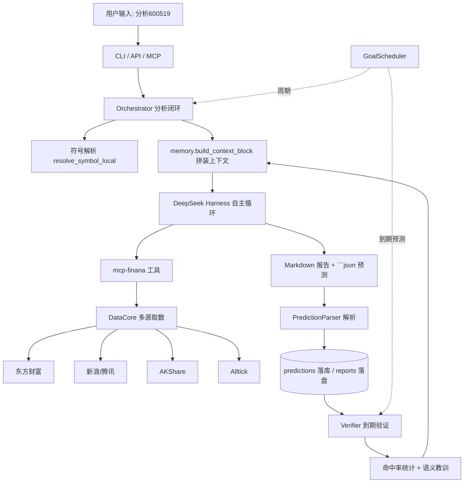

# FinAna v2 — 个股趋势研判系统

<div align="center">

**用户问一只股票，给出相对可靠、可验证的趋势判断。** 基于 DeepSeek Harness 自主智能体循环 + 真实财经数据多源聚合 + 四层记忆 + 预测验证闭环。

</div>

---

## 📖 简介

FinAna v2 的演进主线：输入一只股票（A 股为主），系统拉取真实行情/财务/新闻/资金数据，交由 DeepSeek Harness 自主调研生成研判报告，并解析出**可被未来验证的趋势预测**，到期自动回测命中率，沉淀为语义教训。

### 核心能力

- 🤖 **DeepSeek Harness 自主调研**：通过 `cordis.finana.yml` 组合 + `mcp-finana` 工具，模型自主循环取数、推理、产出报告（非固定流水线）。
- 📊 **真实数据多源聚合**：东方财富（主）+ 新浪/腾讯（行情/K线/新闻兜底）+ AKShare（K线）+ Alltick（美股/港股）；新闻跨源聚合去重。
- 🧠 **四层记忆**：标的记忆 / 语义教训 / 用户画像 / 会话记忆 + 预测库，SQLite + FTS5 持久化于 `~/.finana/finana.db`。
- 🎯 **预测验证闭环**：解析模型输出的 ```` ```json ```` 预测块 → `predictions` 落库（pending）→ 到期拉真实价验证 → 写回 verdict → 统计命中率。
- 🗓️ **目标与调度**：自然语言建目标（如「每月跟踪贵州茅台」），后台调度器按期回访并验证到期预测。
- 🔌 **MCP 工具服务**：`mcp-finana` 以 stdio 暴露 8 个数据工具 + 3 个记忆工具，供 Harness 调用。
- 🌐 **多入口**：命令行 REPL / `--once`、FastAPI Web（含静态页与 SSE）、MCP server、定时 `cron`。

---

## 🏗️ 架构



### 关键组件（`finana/` 包）

| 模块 | 职责 |
|------|------|
| `config.py` | `Settings`：从环境变量 / `.env` 读取（API Key、harness 运行模式、数据 provider 顺序、主目录等）。 |
| `datacore/` | 真实财经数据层。`core.DataCore` 门面按域路由 failover + TTL 缓存 + 熔断器；`base.DomainRouter` 支持**多源聚合去重**；`providers/` 实现 eastmoney / sina_tencent / akshare / alltick；`http.py` 统一 UA、退避重试、curl_cffi 反爬兜底。 |
| `harness_adapter.py` | 隔离所有 DeepSeek Harness 交互：wheel / npm 双运行模式、重试、输出归一化为 `AnalysisOutcome`。 |
| `prediction/parser.py` | 从模型输出解析 ```` ```json ```` 预测块（方向 / 置信度 / 区间 / 周期 / 失效条件）。 |
| `memory/service.py` | 四层记忆（标的 / 语义 / 画像 / 会话 / 预测）+ FTS5 检索；`accuracy_stats` 命中率聚合。 |
| `orchestrator.py` | 单次分析闭环：符号解析 → 上下文 → harness run → 预测落库 → 报告落盘 + metric。 |
| `goals.py` | 目标管理（建目标 / 启发式解析 / 到期扫描 / 回访）。 |
| `verifier.py` | 到期预测验证：拉真实价 → 判定方向 → 写回 verdict → 沉淀语义教训。 |
| `scheduler.py` | `GoalScheduler`：处理到期目标回访 + 到期预测验证，可 `start()` 后台线程。 |
| `mcp_server/server.py` | `mcp-finana`：8 数据工具 + 3 记忆工具，stdio 暴露给 Harness。 |
| `api.py` | FastAPI：`/api/analyze`、`/api/goals`、`/api/verify/run`、`/api/accuracy`、`/api/profile`、`/api/metrics`、`/api/chat`(SSE)、`/api/cron`、`/api/reports` + 静态页。 |
| `cli.py` | 交互式 REPL + `--once`；子命令 `web` / `cron`；斜杠命令 `/profile /track /goals /sessions /accuracy /doctor /stats`。 |
| `prompts/` | `system_prompt.md` + `prediction_format.md` + `skills/`（Harness 角色与工具约定）。 |
| `storage/db.py` | SQLite 连接 + `schema.sql`（FTS5 虚拟表）。 |
| `doctor.py` | `finana-doctor`：逐域探测取数渠道健康，输出熔断状态快照。 |

### 数据来源（A 股为主）

| 域 | 东方财富 | 新浪/腾讯 | AKShare | Alltick |
|----|---------|----------|---------|---------|
| 行情 quote | ✅ | ✅ 兜底 | — | — |
| K线 kline | ✅ | ✅ | ✅ | — |
| 资金流 moneyflow | ✅ | — | — | — |
| 两融 margin | ✅ | — | — | — |
| 龙虎榜 lhb | ✅ | — | — | — |
| 财务 financials | ✅ | — | — | — |
| 新闻 news | ✅ 个股 | ✅ 市场要闻(聚合) | — | — |
| 板块 sector | ✅ | — | — | — |

> 新闻等列表型数据走**多源聚合**：东财个股新闻 + 新浪市场要闻合并去重，单源失败不影响整体。
> 美股/港股渠道与 symbol、L3 向量记忆、推送通知属后续范围（见文末「已知限制」）。

---

## 🚀 快速开始

### 1. 环境与依赖

```bash
git clone <repo> && cd FinAna
python3 -m venv .venv
source .venv/bin/activate
pip install -r requirements.txt
# 说明：
#   deepseek-harness-sdk 需 --pre 安装；macOS x86_64 无 runtime-bin 轮子时：
#     pip install --no-deps deepseek-harness-sdk==0.1.1rc1
# 可选增强（缺失自动降级，不影响核心）：
#     pip install "akshare" "curl_cffi>=0.7"
```

### 2. 安装 DeepSeek Harness 运行时

Harness 提供 **wheel（默认）** 与 **npm（mac-x64 必须）** 两种运行模式：

```bash
# 安装 npm 运行时（幂等，可重复执行）
bash scripts/install-dsh.sh

# macOS x86_64 无 runtime-bin 轮子：安装后设置 DSH_NPM_BIN 即可，
# DSH_RUNTIME=auto 会自动回退到 npm 模式（无需手动改为 npm）：
export DSH_NPM_BIN="$(node -e "console.log(require('path').resolve('node_modules/@deepseek-ai/dsh-sdk-jsonrpc-demo/lib/packaged-bin.js'))")"
```

### 3. 配置 API Key 与主目录

```bash
export DEEPSEEK_API_KEY=sk-xxxx          # 必填
export DSH_RUNTIME=auto                  # auto: wheel 优先，缺失 runtime-bin 时自动回退 npm
# 可选：FINANA_HOME 默认 ~/.finana（存数据库/报告/日志）
```

### 4. 首次运行（自检取数）

```bash
python -m finana.doctor --symbol 600519
# 输出各域取数渠道健康；若见 ConnectionError 多为东财临时限流，稍后重试或依赖兜底源
```

---

## 🖥️ 运行方式

### 命令行（推荐先试）

```bash
# 单次分析
python -m finana.cli --once "分析600519近期走势"

# 交互式 REPL（支持多轮追问与斜杠命令）
python -m finana.cli
```

REPL 斜杠命令：

| 命令 | 作用 |
|------|------|
| `/profile [set k=v ...]` | 查看/更新用户画像（风险偏好、风格、关注列表、反馈）。 |
| `/track <描述>` | 建目标，如 `/track 每月跟踪贵州茅台`。 |
| `/goals` | 列出所有目标。 |
| `/sessions` | 显示当前会话 ID。 |
| `/accuracy [symbol]` | 查看预测命中率统计。 |
| `/doctor` | 运行取数渠道健康探测。 |
| `/stats [today\|7d]` | 查看运行指标聚合。 |
| `/new` `/session` `/help` `/quit` | 会话与帮助。 |

### Web API 与界面

```bash
# 方式一：uvicorn（web_app 含静态界面；若只需 API 可用 finana.api:app）
uvicorn finana.api:web_app --reload --port 8000
# 方式二（等价）：CLI 启动 web
python -m finana.cli web 8000
```

- API 文档：http://localhost:8000/docs
- 静态界面：http://localhost:8000/ （`finana/web/static/index.html`）
- 流式分析（SSE）：`POST /api/chat`

主要端点：

| 端点 | 方法 | 说明 |
|------|------|------|
| `/api/analyze` | POST | 单次分析，返回报告与解析出的预测。 |
| `/api/chat` | POST | SSE 流式分析。 |
| `/api/goals` `/api/goals/{id}/status` | GET/POST | 目标列表 / 建目标 / 改状态。 |
| `/api/verify/run` | POST | 手动触发到期预测验证。 |
| `/api/accuracy/{symbol}` | GET | 命中率统计。 |
| `/api/profile` | GET/PUT | 用户画像读写。 |
| `/api/metrics` | GET | 运行指标聚合。 |
| `/api/cron` | POST | 运行一次调度（目标回访 + 预测验证）。 |
| `/api/reports` `/api/reports/{name}` | GET | 报告列表 / 读取落盘报告。 |

### MCP 工具服务（供 Harness 调用）

```bash
python -m finana.mcp_server.server        # stdio 传输，由 cordis.finana.yml 组合拉起
```

### 后台调度

```bash
python -m finana.cli cron                 # 立即处理一次到期目标与预测
# 或在代码内 Scheduler().start(interval_seconds=3600) 启动常驻线程
```

---

## 🧪 测试

```bash
source .venv/bin/activate
.venv/bin/python -m pytest tests/v2/ -q    # 现行套件（不依赖外部 LLM/网络，使用 FakeHarness 注入）
```

约定：所有 DeepSeek Harness 交互隔离在 `harness_adapter.py`；自动化测试用 `FakeHarness` 注入，不构造真实 harness。缺少 API Key 时真实 E2E 自动跳过（`scripts/smoke_e2e.py`）。

---

## ⚙️ 配置（环境变量）

| 变量 | 说明 | 默认 |
|------|------|------|
| `DEEPSEEK_API_KEY` | DeepSeek API Key（必填） | — |
| `DEEPSEEK_BASE_URL` | API 地址 | 内置默认 |
| `DSH_MODEL` | Harness 模型 | `deepseek-v4-flash` |
| `DSH_RUNTIME` | `auto` / `wheel` / `npm` | `auto` |
| `DSH_NPM_BIN` | npm 模式可执行入口（mac-x64 必填） | — |
| `FINANA_HOME` | 主目录（库/报告/日志） | `~/.finana` |
| `PROVIDER_ORDER` | 数据 provider 顺序 | `eastmoney,sina_tencent,akshare,alltick` |
| `ALLTICK_TOKEN` | Alltick 令牌（美股/港股源） | — |
| `LOG_LEVEL` | 日志级别 | `INFO` |
| `HTTP_TIMEOUT` | 取数超时（秒） | `10` |

---

## 📁 目录结构（v2）

```
finana/
├── config.py            # Settings
├── datacore/           # 真实财经数据层（多源 fallback + 聚合）
│   ├── core.py         # DataCore 门面
│   ├── base.py         # 熔断器 / TTL 缓存 / 域路由(含聚合)
│   ├── http.py         # 统一 HTTP（UA/退避重试/curl_cffi 兜底）
│   ├── models.py       # Quote/KLine/MoneyFlow...
│   ├── symbols.py      # 代码归一化与 secid 转换
│   └── providers/      # em / sina_tencent / akshare_p / alltick
├── harness_adapter.py  # DeepSeek Harness 适配（wheel/npm/重试/归一化）
├── prediction/parser.py# 预测块解析
├── memory/service.py   # 四层记忆 + FTS5 + 命中率
├── orchestrator.py     # 单次分析闭环
├── goals.py            # 目标规划与管理
├── verifier.py         # 到期预测验证
├── scheduler.py        # 目标/预测后台调度
├── mcp_server/         # mcp-finana 工具服务
├── api.py              # FastAPI 应用
├── cli.py              # REPL + --once + web + cron
├── doctor.py           # 取数渠道健康探测
├── prompts/            # system_prompt / prediction_format / skills
├── web/static/         # 静态界面
├── storage/db.py       # SQLite + schema.sql
└── cordis.finana.yml   # DeepSeek Harness 组合（含 mcp-finana 段）
```

---

## ⚠️ 已知限制 / 免责声明

- 当前以 **A 股**为首要支持市场；美股/港股渠道（Alltick，需令牌）与对应 symbol 解析属后续范围。
- 东财 `push2` 接口偶发 IP 级限流导致资金流/新闻瞬时失败，系统已通过重试与多源兜底缓解，但极端限流下个别域可能短暂不可用。
- 报告与预测**不构成投资建议**；投资有风险，决策需谨慎。

---

## 📄 许可证

MIT License
